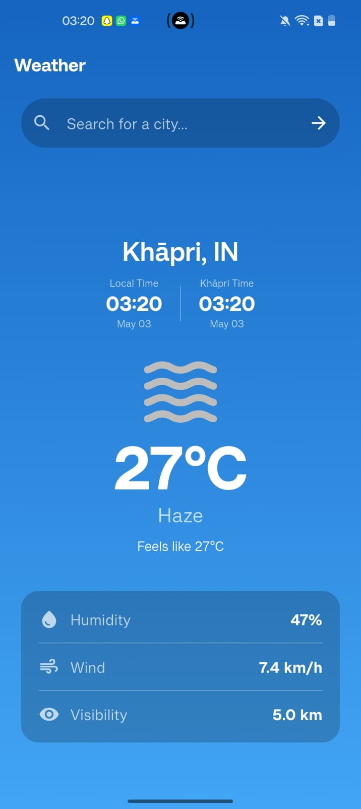
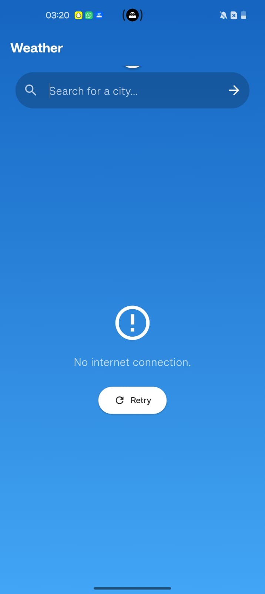
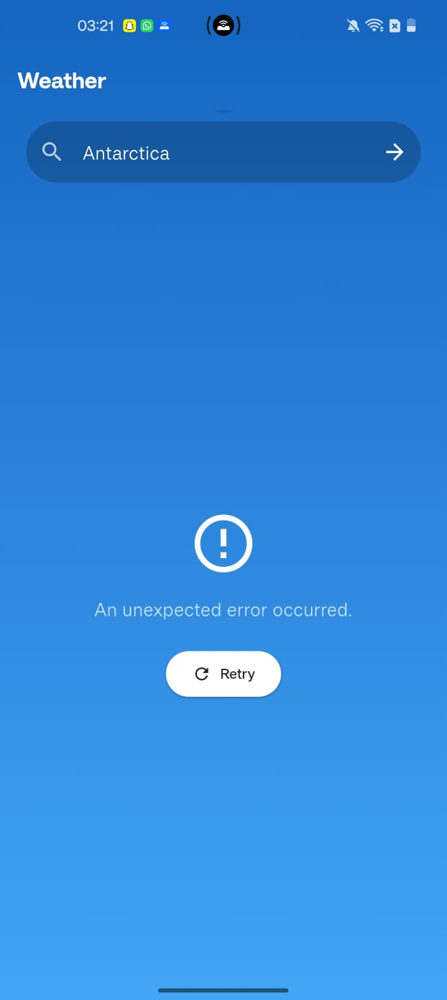
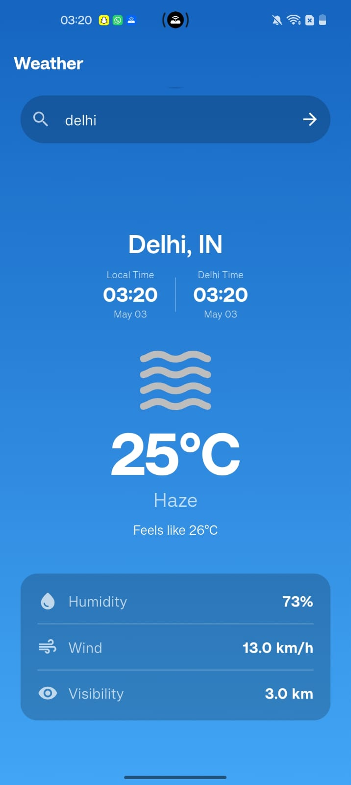

# 🌤️ Weather App — Flutter Project

**Subject:** Application Development (AppDev)
**Tech Stack:** Flutter · Dart · OpenWeatherMap REST API
**Platform:** Android (also supports iOS, Web, Windows, macOS, Linux)

---

## What is this project?

This is a weather forecasting mobile application built using Flutter . The idea is pretty simple — you type in a city name , and the app fetches real-time weather data and displays it in a clean, animated UI.

The app **consumes the OpenWeatherMap REST API with full error handling for network failures, invalid cities, and timeouts 

---

## Features

- Search weather by **city name**
- Auto-detect weather using your **current GPS location**
- Pull-to-refresh to get the latest data
- Dynamic **background gradient** that changes based on weather conditions (clear → orange/yellow, cloudy → grey, rainy → teal)
- Displays temperature, feels-like, humidity, wind speed, and visibility

---

## Project Structure

Here's how I organized the code inside `lib/`:

```
lib/
├── main.dart                    # App entry point, sets up Provider
├── models/
│   └── weather_model.dart       # Data model that parses the API JSON response
├── providers/
│   └── weather_provider.dart    # State management — handles all fetch logic
├── screens/
│   └── home_screen.dart         # The main (and only) screen
├── services/
│   └── weather_service.dart     # Makes actual HTTP calls to OpenWeatherMap
├── utils/
│   ├── app_theme.dart           # Theme configuration
│   └── constants.dart           # API key and base URL
└── widgets/
    ├── weather_card.dart        # Displays the weather info
    ├── error_widget.dart        # Error state with retry button
    ├── loading_widget.dart      # Loading spinner
    └── detail_row.dart          # Reusable row for humidity/wind/visibility
```

I tried to keep each file focused on one thing. The service layer only handles HTTP. The provider handles state. The widgets just display data. It felt cleaner this way and made debugging a lot easier.

---

## How the API Integration Works

I'm using the **OpenWeatherMap Current Weather API** (`/data/2.5/weather`). The app supports two ways to call it:

**By city name:**
```
GET https://api.openweathermap.org/data/2.5/weather?q={city}&appid={key}&units=metric
```

**By coordinates (for GPS-based fetch):**
```
GET https://api.openweathermap.org/data/2.5/weather?lat={lat}&lon={lon}&appid={key}&units=metric
```

Both calls live in `WeatherService`, and the JSON response gets parsed into a `WeatherModel` object. I also do a couple of small unit conversions there — the API returns wind speed in m/s and visibility in meters, so I convert those to km/h and km respectively before passing them to the UI.

---

## Error Handling (The Part I'm Actually Proud Of)

Honestly, error handling was the part that took the most trial and error (no pun intended). Here's what the app handles:

**No internet connection** — If the user has no internet, a `SocketException` is thrown by Dart's HTTP library. I catch that and show a friendly "No internet connection." message instead of letting the app crash.

**Request timeouts** — The HTTP request has a 10-second timeout set using `.timeout(const Duration(seconds: 10))`. If the server takes too long to respond, a `TimeoutException` fires and the user sees "Request timed out. Try again." — not a frozen loading spinner that runs forever.

**Invalid city names** — If someone types "Londoon" or a city that doesn't exist, OpenWeatherMap returns a 404 status code. I check for that specifically and throw a `WeatherException` with the message "City not found. Try again."

**Invalid API key** — A 401 response means the API key is wrong or missing. This was actually super useful during development when I was setting things up. The error message says "Invalid API key. Please check your configuration."

**Any other server errors** — For any status code that isn't 200, 404, or 401, I fall through to a general catch that tells the user to try again later.

**Custom exception class** — I created a `WeatherException` class so all error messages flow through one consistent type. The provider catches it and exposes an `errorMessage` string to the UI, which the `CustomErrorWidget` then displays along with a retry button.

Here's a simplified look at the error handling structure in `weather_service.dart`:

```dart
try {
  final response = await http.get(url).timeout(const Duration(seconds: 10));

  if (response.statusCode == 200) {
    return WeatherModel.fromJson(json.decode(response.body));
  } else if (response.statusCode == 404) {
    throw WeatherException('City not found. Try again.');
  } else if (response.statusCode == 401) {
    throw WeatherException('Invalid API key. Please check your configuration.');
  } else {
    throw WeatherException('Failed to fetch weather data. Please try again later.');
  }

} on SocketException {
  throw WeatherException('No internet connection.');
} on TimeoutException {
  throw WeatherException('Request timed out. Try again.');
} catch (e) {
  if (e is WeatherException) rethrow;
  throw WeatherException('An unexpected error occurred.');
}
```

---

## Data Model

The `WeatherModel` holds all the data the UI needs:

| Field | Type | Source (API JSON key) |
|---|---|---|
| `cityName` | String | `name` |
| `countryCode` | String | `sys.country` |
| `temperature` | double | `main.temp` |
| `feelsLike` | double | `main.feels_like` |
| `condition` | String | `weather[0].description` |
| `icon` | String | `weather[0].icon` |
| `humidity` | int | `main.humidity` |
| `windSpeed` | double (km/h) | `wind.speed × 3.6` |
| `visibility` | double (km) | `visibility ÷ 1000` |
| `timezoneOffsetSeconds` | int | `timezone` |

---

## Dependencies

| Package | Version | Purpose |
|---|---|---|
| `http` | ^1.2.0 | Making REST API calls |
| `provider` | ^6.1.2 | State management |
| `geolocator` | ^13.0.0 | Getting device GPS location |
| `intl` | ^0.19.0 | Date/time formatting |
| `flutter_launcher_icons` | ^0.13.1 | Generating custom app icons |

---

## What I Learned

This project taught me a lot about building real-world apps, not just simple demos. A few things that stood out:

- **API integration is not just about the happy path.** Thinking through every possible failure — no internet, bad input, slow server — made the app significantly more usable and less fragile.
- **Provider makes state management a lot less painful.** Separating data/logic from the UI made the code easier to understand and debug. It also made adding new states (like the `initial` state) straightforward without touching the UI widgets at all.
- **Flutter's animation widgets are surprisingly powerful.** `AnimatedSwitcher` for state transitions and `AnimatedContainer` for the gradient background change gave the app a much more polished feel without a lot of extra code.
- **Geolocator permission flows are more involved than expected.** On Android, you really have to check each permission step manually — you can't just call `getCurrentPosition()` and hope for the best.
- **Custom exception classes make life easier.** Instead of catching raw strings or generic exceptions everywhere, having `WeatherException` as a single type made the error flow consistent across the whole app.

---

## Screenshots

### App Screen


### App Startup


### No Internet Connection


### API Error


### Search Result


---

